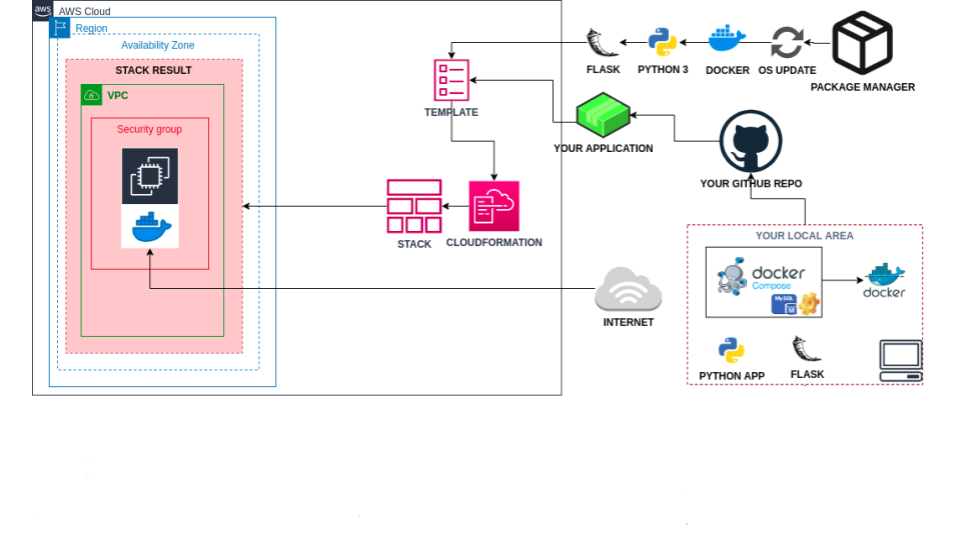

# Dockerization of Bookstore Web API (Python Flask) with MySQL

## Description

Bookstore Web API Application aims to create a bookstore web service using Docker. The application code is to be deployed as a RESTful web service with Flask using Dockerfile and Docker Compose on AWS Elastic Compute Cloud (EC2) Instance using Terraform.

## Problem Statement

 

  - Get the application code from the GitHub repository.

  - Create docker image using the `Dockerfile`.

  - Deploy the app using `docker compose`. To do so;

    - Create a database service using MySQL.

    - Configure the app service to run on `port 80`.

    - Use a custom network for the services.

- In the development environment, you can configure your Terraform config file using the followings,

  - The application should be created with new AWS resources.

  - The application should run on Amazon Linux 2 EC2 Instance

  - EC2 Instance type can be configured as `t2.micro`.

  - Instance launched by Terraform should be tagged `Web Server of Bookstore`

  - The Web Application should be accessible via web browser from anywhere.

  - The Application files should be downloaded from Github repo and deployed on EC2 Instance using user data script within Terraform configuration file.

  - Bookstore Web API URL should be given as output byTerraform, after the resources created.

## Resources

- [Representational State Transfer](https://en.wikipedia.org/wiki/Representational_state_transfer)

- [Terraform AWS Provider Documentaion](https://registry.terraform.io/providers/hashicorp/aws/latest/docs)

- [AWS Cloudformation User Guide](https://docs.aws.amazon.com/AWSCloudFormation/latest/UserGuide/Welcome.html) (Optional)
